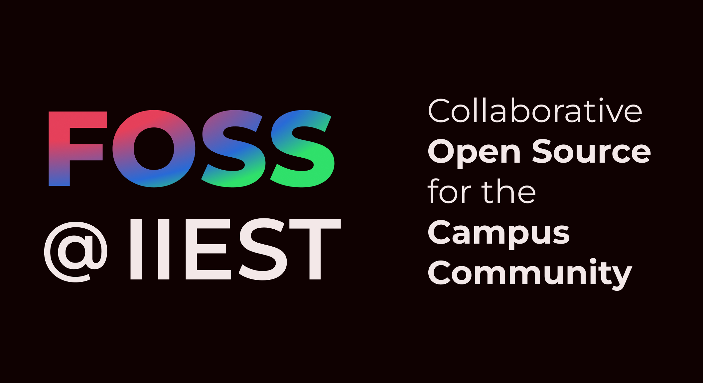

# FOSS@IIEST

## What?
This is an initiative to build and promote tools that solve problems within the **IIEST** college community, while also encouraging a culture of *Free and Open Source Software* (FOSS).

## How?

1. We host tools, scripts, and shortcuts to make student life easier.
2. We keep a central place for student projects so good ideas are not forgotten.
